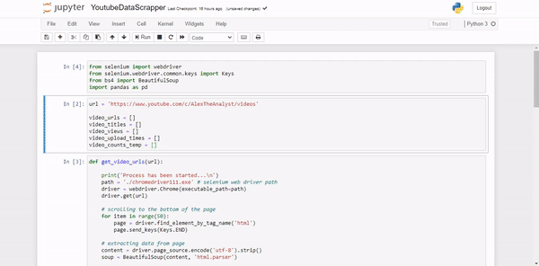

# Youtube video information scrapper
This repository involves web scrapping technique, demonstrated how to collect the information about all videos which are available on youtube channel. Youtube video views, video uploaded time, video title, video url, etc we can scrap using selenium webdriver

<div align="center">
  <a href="https://github.com/kunalk3/Data_scraping_and_text_analysis/tree/main/YouTube_scraper_selenium/issues"></a>
  <a href="https://github.com/kunalk3/Data_scraping_and_text_analysis/tree/main/YouTube_scraper_selenium/graphs/contributors"></a>
  <a href="https://www.python.org/downloads/release/python-390/">
  <a href="https://github.com/kunalk3/Data_scraping_and_text_analysis/blob/main/LICENSE"></a>
  <a href="https://github.com/kunalk3/Data_scraping_and_text_analysis/tree/main/YouTube_scraper_selenium"></img></a>
  <a href="https://github.com/kunalk3/Data_scraping_and_text_analysis/tree/main/YouTube_scraper_selenium">
</div>

<div align="center">   
  
  [](https://www.microsoft.com/en-in/)
  [](https://code.visualstudio.com/)
  [](https://jupyter.org/)
  [](https://www.jetbrains.com/pycharm/)
  [](https://colab.research.google.com/?utm_source=scs-index/)
  [](https://www.spyder-ide.org/)
</div>
  
---
  
## :bulb: Demo
- Below is the demonstrated sample at my local environments/ system.


#### _Input_ - 
URL = `https://www.youtube.com/c/AlexTheAnalyst/videos`
  
#### _Output_ - 


---
  
## :wrench: Installation
- Create __virtual environment__ `python -m venv VIRTUAL_ENV_NAME` and activate it `.\VIRTUAL_ENV_NAME\Scripts\activate`.
- Install necessary library for this project from the file `requirements.txt` or manually install by `pip`.
  ```
  pip install -r requirements.txt
  ```
  To create project library requirements, use below command,
  ```
  pip freeze > requirements.txt
  ```
- About selenium web-driver, please check the __version__ of chrome browser first. If chrome browser version is _95.0.4638.17_, need to download chrome driver for the same _95.0.4638.17_ from here [Chromedriver](https://chromedriver.chromium.org/downloads). Extract the driver and place it into the folder _data_.
- After dependency and selenium driver completition, run python file.
  ``` 
  python youtubeDataScript.py
  ```
---  
   
### :iphone: Connect with me
`You say freak, I say unique. Don't wait for an opportunity, create it.`
  
__Let’s connect, share the ideas and feel free to ping me...__
  
<div align="center"> 
  <p align="left">
    <a href="https://linkedin.com/in/kunalkolhe3" target="blank"></a>
    <a href="https://github.com/kunalk3/" target="blank"></a>
    <a href="mailto:kunalkolhe333@gmail.com" target="blank"></a>
    <a href="https://www.hackerrank.com/kunalkolhe333" target="blank"></a>
    <a href="https://fb.com/kunal.kolhe.98" target="blank"></a>
    <a href="https://instagram.com/kkunalkkolhe" target="blank"></a>
  </p>
</div> 

